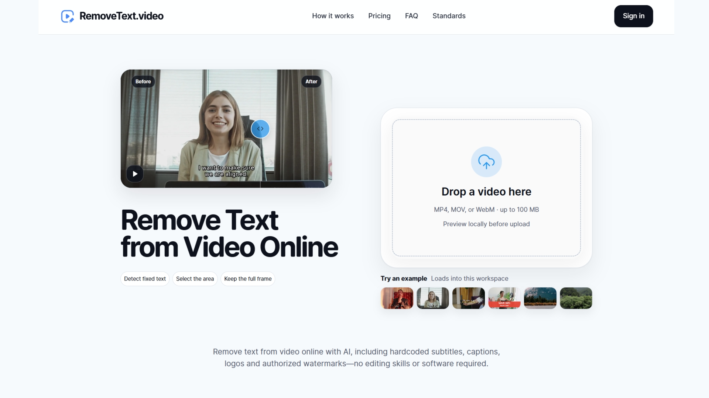
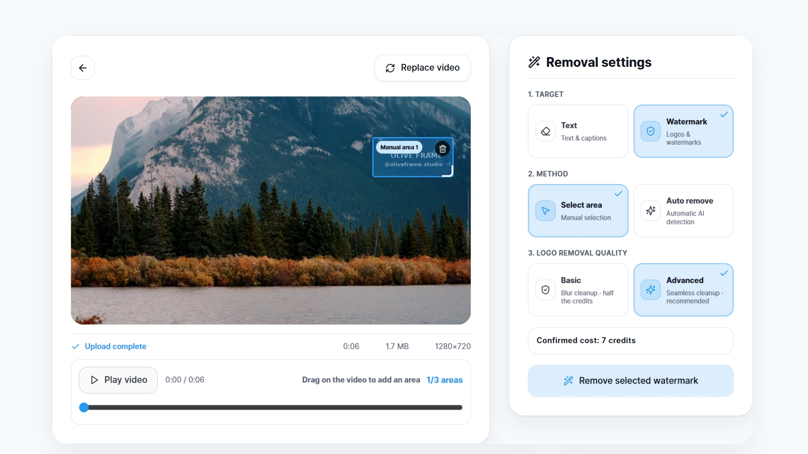

# Remove Text from Video Online

  

**[RemoveText.video](https://removetext.video)** is an online video cleanup tool for removing hardcoded text, subtitles, captions, logos, and authorized watermarks while preserving the original framing.

It is built for creators, editors, marketers, educators, and small teams who need a cleaner version of an existing clip without rebuilding the whole project. Instead of cropping the frame or covering old text with another graphic, you choose the area that needs attention and process only that part of the video.

  <a href="https://removetext.video">Try RemoveText.video</a> ·
  <a href="https://removetext.video/faq">FAQ</a> ·
  <a href="https://removetext.video/pricing">Pricing</a> ·
  <a href="https://removetext.video/video-processing-standards">Processing standards</a>

## What it does

- Removes hardcoded text such as dates, titles, labels, timestamps, and social overlays.
- Cleans embedded subtitles and captions before localization or a new edit.
- Supports cleanup of logos and watermarks only when you own the footage or have permission to modify it.
- Offers automatic fixed-text detection and manual selection of up to three target areas.
- Keeps the original framing instead of relying on cropping.

## When to use it

RemoveText.video is most useful when the text is visible in the same area for much of the clip. Fixed captions, corner timestamps, burned-in labels, lower-third titles, and simple overlay graphics are usually better candidates than text that moves across faces, hands, reflections, or detailed backgrounds.

Typical cleanup tasks include:

- Preparing a clean master before adding new subtitles or translated captions.
- Removing an outdated title, date, social handle, or campaign label from a reusable clip.
- Removing an authorized logo, watermark, or internal review mark from footage you control.
- Preserving the original aspect ratio when cropping would remove important visual context.

Text over flat backgrounds is generally easier to reconstruct than text over fast motion, small faces, hair, hands, water, reflections, screen recordings with tiny UI details, or fine textures. Always review the finished video before publishing or sending it to a client.

## Supported video cleanup modes

The product currently presents five cleanup modes: text, subtitles, captions, logos, and watermarks. These modes help you describe what kind of overlay you want to remove, while the final result still depends on the video content, the selected area, and the detail behind the overlay.

For fixed text, automatic detection can save time by finding likely text areas from sampled frames in the browser. When automatic detection is too broad, misses the target, or the overlay changes across the clip, you can switch to manual selection and mark up to three areas. Manual selection gives you tighter control over what gets processed and helps avoid spending credits on parts of the frame that do not need cleanup.

## How it works

1. Select an MP4, MOV, or WebM video. A local browser preview is created first.
2. Choose the target type and use automatic detection for fixed text or mark up to three areas manually.
3. Review the selected area, source dimensions, and estimated credit cost.
4. Sign in when required, start processing, then review and download the finished video.

## What to check before processing

Before you start a job, review the selected target area, source dimensions, cleanup mode, and estimated credit cost. The best selection is usually close to the overlay without being so tight that it clips the letters across frames. If the selected box covers too much of the scene, the output may need to reconstruct more background than necessary.

For best results:

- Use the smallest practical selection that fully covers the unwanted overlay.
- Keep the selection stable when the text stays in one place.
- Avoid selecting faces, hands, product details, or important UI text unless they are part of the area you intentionally want to repair.

After processing, watch the full output rather than checking only the first frame. Some artifacts are only visible during motion, especially when the background changes behind the removed text.

## Privacy and availability

Selecting a video and running automatic fixed-text detection happen locally in the browser. The upload begins only after you confirm the processing details and choose **Process**.

After Google sign-in, the service provides 30 lifetime trial credits for original-dimension processing up to 1080p. Trial credits do not renew monthly. Retention controls keep free-trial originals and outputs for up to 24 hours; paid originals for up to 7 days; and paid outputs for up to 30 days.

Processing credits depend on duration, cleanup service, and source dimensions. For standard cleanup, a 480p to 720p source short side uses about 1 credit per second, while a 721p to 1080p source uses about 2 credits per second. Basic logo or watermark cleanup uses half the applicable rate. The server checks the source video before confirming the final amount, and credits held for a job are returned if processing cannot complete.

RemoveText.video keeps temporary working files only for the requested job and applies different retention periods for trial and paid media. These limits are intended to give you time to review and download results without treating the service as long-term storage.

For complete product, privacy, and usage information, see the [FAQ](https://removetext.video/faq), [Privacy Policy](https://removetext.video/privacy), and [Terms of Service](https://removetext.video/terms).

## Processing expectations

Video text removal works by rebuilding the selected area across frames. The result can look clean when the hidden background is predictable, but difficult footage may still show blur, texture mismatch, edge artifacts, or inconsistent detail.

Use RemoveText.video as part of a review workflow: choose the area carefully, process the clip, inspect the output, and decide whether it is ready to publish.

For current limits and supported processing rules, see the [Video Processing Standards](https://removetext.video/video-processing-standards).

## Authorized use

Use the service only for videos you own, are licensed to edit, or otherwise have permission to modify. Do not remove copyright notices, creator attribution, provenance labels, platform marks, safety disclosures, legally required notices, or other marks you are not authorized to remove.

Authorized uses may include cleaning your own drafts, updating old internal videos, preparing licensed footage for a new edit, or removing marks from material where the rights holder has given permission.

## Frequently asked questions

### Does the tool crop the video?

No. The service is designed to preserve the original framing instead of removing text by cropping the frame. You select the area to repair, and the processed output keeps the source composition when the video is supported.

### Is the video uploaded as soon as I select it?

No. Selecting a file creates a local browser preview first. Automatic fixed-text detection also runs locally on sampled frames. Upload begins only after you confirm the processing details and start the job.

### Can I remove any watermark?

Only remove watermarks, logos, or other marks when you own the video, are licensed to edit it, or have permission from the rights holder. RemoveText.video is not intended for removing attribution, ownership marks, legal notices, or platform labels without authorization.

### What should I do if the result is not clean enough?

Try a tighter target area, choose manual selection when automatic detection is too broad, or test a shorter clip first. Some footage is naturally harder to repair, especially when text overlaps moving faces, hands, reflections, or detailed textures.

## Public repository scope

This repository is a public product reference for RemoveText.video. It contains selected product information and official visual assets. It does **not** contain the production website source code, deployment configuration, private services, or a public developer API.

For public product feedback, open a GitHub issue. For account, privacy, or support requests, use the contact options on [removetext.video](https://removetext.video).

## Maintained by

RemoveText.video
